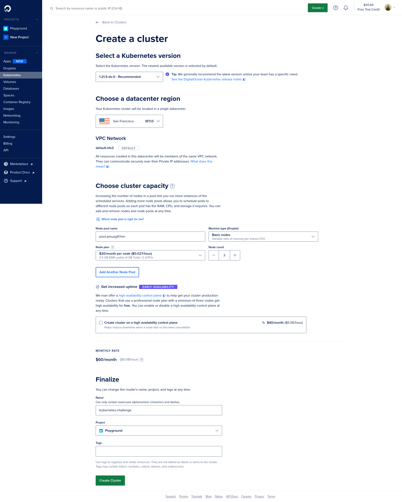
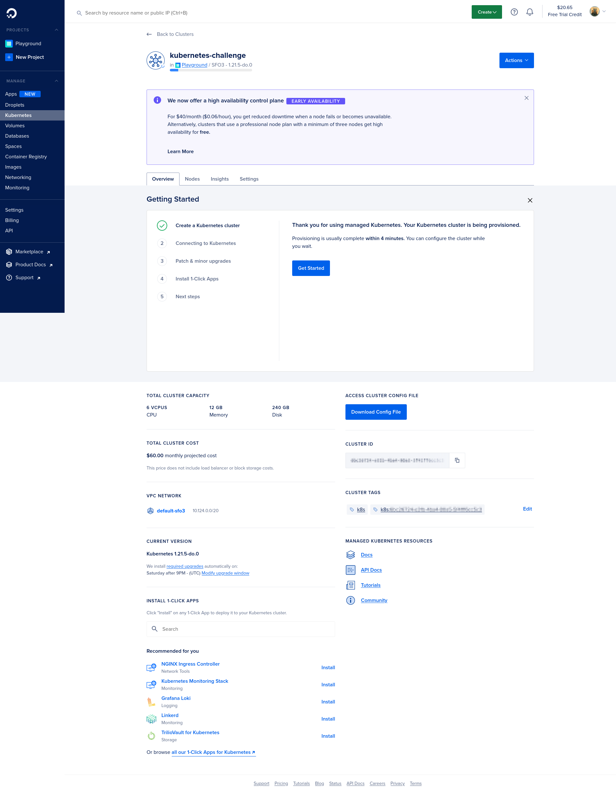

# DigitalOcean Kubernetes Challenge

This repository contains the artifacts of accomplishment of [DigitalOcean Kubernetes Challenge](https://www.digitalocean.com/community/pages/kubernetes-challenge).

The challenge I chose is to deploy a scalable SQL database cluster reling on Kubegres operator for PostgreSQL.

Video demonstring everything working: https://youtu.be/mQWo_Jih2jA.

## Create Kubernetes cluster on DigitalOcean

1. Creation of a Kubernetes cluster using DigitalOcean's UI is very simple:
- Open DigitalOcean's Kubernetes section and next click on the button "Create a Kubernetes Cluster" or follow to this link: https://cloud.digitalocean.com/kubernetes/clusters/new
- Default values for our cluster are already fine for this demo:
  - Select a Kubernetes version: I kept the recommended one at the time, `1.21.5-do.0`
  - Choose any data center region: I kept the default selected
  - Keep the node count as `3`
  - Give a name to the cluster: `kubernetes-challenge`
  - Finally click on "Create Cluster" button

Next is the cluster creation screen with data filled as defined above:



2. After clicking on the "Create Cluster" button, it will present a screen with a progress bar at the top, as shown below. Now, we just need to wait for the cluster creation process to end. Note the message: `provisioning is usually complete within 4 minutes. You can configure the cluster while you wait`.



3. As our cluster is created, download its config file (`.yaml`), for this, click on the button "Download Config File". I placed it on `$HOME/Downloads/kubernetes-challenge-kubeconfig.yaml`.

## Install and configure `kubectl` command

1. Install the [Kubernetes official client (kubectl)](https://kubernetes.io/docs/tasks/tools/#kubectl) on your system.
2. Then, a way to use the previously downloaded Kubernetes config file with `kubectl` is through the `KUBECONFIG` environment variable:
```bash
export KUBECONFIG=$HOME/Downloads/kubernetes-challenge-kubeconfig.yaml
```

1. Listing the nodes from remote cluster:

```bash
kubectl get nodes
```

## Install Kubegres operator on Kubernetes

Kubegres is a Kubernetes Operator that eases the deployment of scalable PostgreSQL databases, it is free/open source and uses standard PostgreSQL Docker images.

Everything I needed for adoption of Kubegres operator is documented at [Kubegres' Getting Started document](https://www.kubegres.io/doc/getting-started.html).

1. Install Kubegres Operator

```bash
kubectl apply -f https://raw.githubusercontent.com/reactive-tech/kubegres/v1.15/kubegres.yaml
```

## Configure a PostgreSQL cluster

1. Create a secret resource for the PostgreSQL instances, file `my-postgres-secret.yaml`:

```yaml
apiVersion: v1
kind: Secret
metadata:
  name: mypostgres-secret
  namespace: default
type: Opaque
stringData:
  superUserPassword: postgresSuperUserPsw # change it
  replicationUserPassword: postgresReplicaPsw # change it
```

2. Apply the secret resource to the cluster:

```bash
kubectl apply -f my-postgres-secret.yaml
```

3. Create a Kubegres resource that configures the PostgreSQL cluster, file `my-postgres.yaml`:

```yaml
apiVersion: kubegres.reactive-tech.io/v1
kind: Kubegres
metadata:
  name: mypostgres
  namespace: default
spec:
  replicas: 3
  image: postgres:14.1
  database:
    size: 1Gi
  env:
    - name: POSTGRES_PASSWORD
      valueFrom:
        secretKeyRef:
          name: mypostgres-secret
          key: superUserPassword
    - name: POSTGRES_REPLICATION_PASSWORD
      valueFrom:
        secretKeyRef:
          name: mypostgres-secret
          key: replicationUserPassword
```

1. Apply the Kubegres resource to the cluster:

```bash
kubectl apply -f my-postgres.yaml
```

Now we should already have our scalable PostgreSQL cluster working.

---

> Note: Only thing that is different from [Kubegres' Getting Started document](https://www.kubegres.io/doc/getting-started.html) is the field `spec.database.size` that changed from `200Mi` to `1Gi`, this is due to DigitalOcean's minimal volume size being `1Gi`.
> Without this change the following error happens when you look at the events:
```
$ kubect get events -w
...

0s          Warning   ProvisioningFailed             persistentvolumeclaim/postgres-db-mypostgres-1-0   failed to provision volume with StorageClass "do-block-storage": rpc error: code = OutOfRange desc = invalid capacity range: required (200Mi) can not be less than minimum supported volume size (1Gi)
```

# Connect to the remote PostgreSQL

We can use a local PostgreSQL client to connect to our remote PostgreSQL instances, for that I will port-forward to a local port:

```bash
kubectl port-forward pod/mypostgres-1-0 54321:5432 # primary
```

After that we can connect to the primary database using localhost:54321.

To connect to a replica we just change the pod name.

```bash
kubectl port-forward pod/mypostgres-2-0 54322:5432 # replica #1
kubectl port-forward pod/mypostgres-3-0 54323:5432 # replica #2
```

After that we can connect to the replicas using localhost:54322 and localhost:54323.

That's it! Everything you change on the primary database will be automatically applied in the replicas.

# Optional - Exposing Kubegres as NodePort

This is not best thing to do, but if you want to expose Kubegres as NodePort I followed an answer from this GitHub issue https://github.com/reactive-tech/kubegres/issues/44

1. Query for the `metadata.ownerReferences[0].uid` in service `myspostgres`:

```bash
kubectl get service mypostgres -o json | jq .metadata.ownerReferences[0].uid
```

2. Create a service resource replacing `THIS-WILL-BE-THE-UID-FROM-REPLICA-SERVICE-CREATED` with the uid from last command, file `my-postgres-primary-service.yaml`:

```yaml
apiVersion: v1
kind: Service
metadata:
  name: mypostgres-primary-np
  namespace: default
  labels:
    app: mypostgresmydb
    replicationRole: primary
  ownerReferences:
  - apiVersion: kubegres.reactive-tech.io/v1
    blockOwnerDeletion: true
    controller: true
    kind: Kubegres
    name: mypostgres
    uid: THIS-WILL-BE-THE-UID-FROM-PRIMARY-SERVICE-CREATED # change it
spec:
  type: NodePort
  ports:
  - port: 5432
    nodePort: 30500
  selector:
    app: mypostgres
    replicationRole: primary
  sessionAffinity: None
```

3. Apply the primary service resource to the cluster:

```bash
kubectl apply -f my-postgres-primary-service.yaml
```

4. Query for the `metadata.ownerReferences[0].uid` in service `myspostgres-replica`:

```bash
kubectl get service mypostgres-replica -o json | jq .metadata.ownerReferences[0].uid
```

5. Create a service resource replacing `THIS-WILL-BE-THE-UID-FROM-REPLICA-SERVICE-CREATED` with the uid from last command, file `my-postgres-replica-service.yaml`:

```yaml
apiVersion: v1
kind: Service
metadata:
  name: mypostgres-replica-np
  namespace: default
  labels:
    app: mypostgres
    replicationRole: replica
  ownerReferences:
  - apiVersion: kubegres.reactive-tech.io/v1
    blockOwnerDeletion: true
    controller: true
    kind: Kubegres
    name: mypostgres
    uid: THIS-WILL-BE-THE-UID-FROM-REPLICA-SERVICE-CREATED # change it
spec:
  type: NodePort
  ports:
  - port: 5432
    nodePort: 30600
  selector:
    app: mypostgres
    replicationRole: replica
  sessionAffinity: None
```
